```{r setup, include=FALSE}
knitr::opts_chunk$set(echo = FALSE)
options(scipen = 999)
```

```{r xaringan-themer, include=FALSE, warning=FALSE}
library(xaringanthemer)
style_mono_accent(
  base_color = "#1c5253",
  header_font_google = google_font("Josefin Sans"),
  text_font_google   = google_font("Montserrat", "500", "600i")
)
```


<div style="text-align: justify">

## Motivación

+ Sabemos, o pensamos, que facilitar el acceso al divorcio empodera a las personas con mayor voluntad o *willingness* de terminar un matrimonio, a través de un aumento en su poder de negociación.

+ Hay evidencia empírica y analítica que sostiene que facilitar el acceso al divorcio reduce la violencia de pareja.

+ Sin embargo, la evidencia empirica se ha obtenido de las experiencias en países desarrollados.

+ **¿Podemos extrapolar?**
---

## Relevancia: Violencia de pareja

<div style="text-align: justify">

+ En el mundo, 1 de cada 3 mujeres han experimentado violencia de pareja (VP, o *intimate partner violence*) (Si lo vemos del otro lado, aproximadamente 1 de cada 3 hombres la ha cometido).

+ Se ha asociado la VP a inestabiliad en el empleo, reducción de productividad y ganancias, a salud deficiente, así como a externalidades negativas en los hijos.

+ En países en desarrollo hay mayor prevalencia del uso de violencia.

---

## Relevancia: Divorcio unilateral

<div style="text-align: justify">

+ El divorcio unilateral permite que el divorcio sea concedido sin necesidad de probar una razón.

+ Empodera a la parte con el mayor *willingness* de terminar el matrimonio.

+ Es un derecho de la agenda progesista del derecho y se ha implementado en países desarrollados desde los 70s; y en países en desarrollo desde los 2000s.

+ No sabemos con certeza el efecto que tiene facilitar el acceso al divorcio en la violencia de pareja en países en desarrollo.

---

## Relevancia: Falta certeza sobre su relación con el divorcio

<div style="text-align: justify">

+ Modelos analíticos y trabajos empíricos en países desarrollados sostienen que con el divorcio unilateral disminuye la violencia.

+ Está también el argumento de que la violencia puede aumentar **si el hombre sigue gozando de poder fáctico y ve al divorcio como una amenaza** de que su esposa “escape”.

+ Entre estas posturas está la respuesta, los modelos asumen que no hay fricciones de valores culturales. Es decir, asumen que un avance legal en la equidad de genero se traduce en un avance real.

+ Los estudios empíricos que se han hecho, comprueban que efectivamente hay una reduccion de violencia pero **¡sorpresa!**, estos se han hecho en paises desarrollados.

+ A grandes rasgos en países en desarrollo hay mayor prevalencia de violencia (de cualquier tipo) y el divorico es menos aceptado culturamente. Asimismo, hay menor apoyo a victimas y mas dificultades en cuando a sostener arreglos judiciales, como el pago de manuntencion.

---

## Pregunta

Debido a lo expuesto anteriormente, surge la pregunta:

+ ¿Existe una relación entre facilitar el acceso al divorcio y la violencia de pareja en México?

---

## Contexto

México es un lugar ideal para evaluar esta pregunta debido a

+ Existe variación en la implementación del divorcio unilateral, temporal y geográficamente.

+ 15 entidades federativas aprobaron una reforma (CDMX en 2008 + 14 estados en 2016).

---

## Divorcio en México


```{r, echo=FALSE, out.width="60%", fig.align="center", fig.cap="Proceso de divorcio bilateral antes y despues de la reforma"}
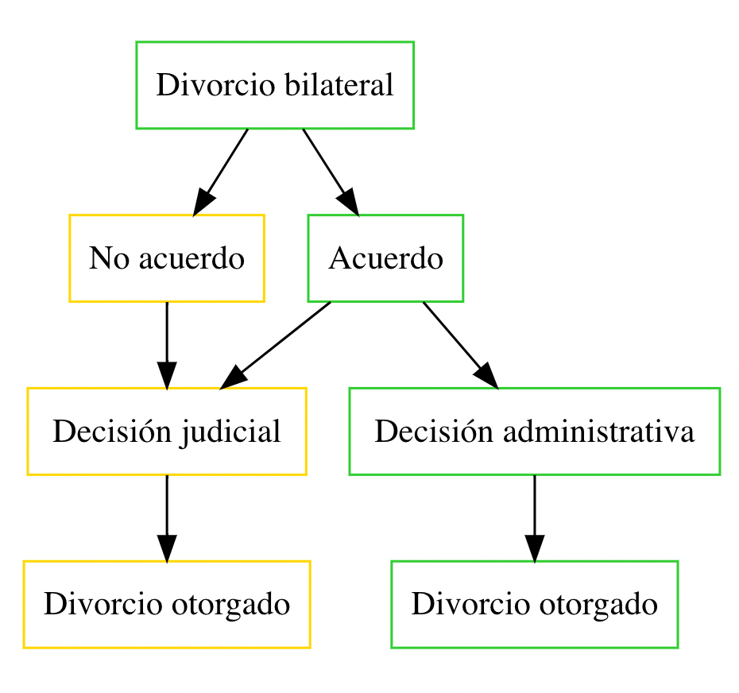
```

+ Con verde vemos los nodos que guían al divorcio otorgado, con rojo aquellos que llevan al denegado, con amarillo aquellos donde el proceso podría terminar en ambos casos.


---

## Divorcio en México

```{r, echo=FALSE, out.width="90%", fig.align="center", fig.cap=" Procedo de divorcio unilateral antes (izquierda) y después (derecha) de la reforma"}
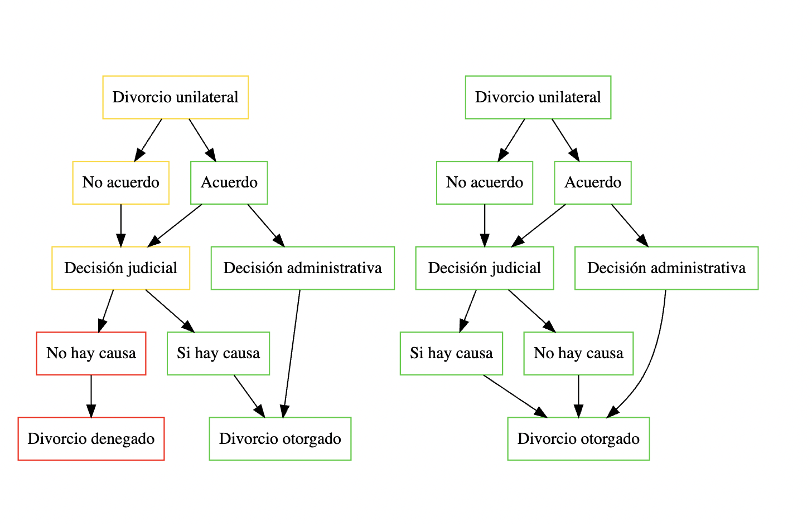
```


---

## Contexto

<div style="text-align: justify">

El divorcio unilateral ha sido sucedido por un incremento significativo en las tasas de divorcio; un incremento en el acumulado de mujeres divorciadas; un decremento en el acumulado de mujeres casadas y finalmente un cambio estadisticamente no significativo en las tasas de matrimonio...

Asimismo, hay efectos de corto y mediano plazo en cuanto al VP: 

+ de 0 a 6 años después de la aprobación, no hay relacion 
+ de 6-8  después existe un aumento del 21%, el cual es estadísticamente significativo.

Estos resultados provienen sobre todo de aquellas mujeres que han seguido casadas despues de la reforma. (La autora sugiere que puede ser que a corto plazo, los hombres tengan herramientas no violentas para disuadirlas de dejarlo pero en el largo plazo estas son insuficientes)

+ Finalmente, el hecho de que la reforma se haya hecho en casi la mitad de las entidades federativas en distintos tiempos permite que la relación entre divorcio y violencia de pareja pueda ser analizada bajo un esquema de Diff-in-diff.

---


## Datos

---
## Datos
### 1.	Encuesta y muestra

* ENDIREH 2016 (Encuesta Nacional sobre la Dinámica de las Relaciona en los Hogares).

  - Recolecta información a detalle sobre la violencia que sufre la mujer en México.

--

.pull-left[

###Años de recolección:

2003: .pull-right[34,184]

2006: .pull-right[133,398]

2011: .pull-right[152,636]

2016: .pull-right[111,256]

]

.pull-right[


<small>Foto: Freepik.</small>

]
---
---
## Datos
### 1.	Encuesta y muestra


--
### Composición de la muestra

La muestra está compuesta por mujeres casadas durante la reforma y que continuaron con el mismo estatus o estaban divorciadas en el momento de la encuesta.

<small>Se excluyeron aquellas que se casaron después de la reforma.</small>

Características de la mujer casada:

-	Mujeres que viven con su pareja.
-	Separadas temporalmente.
-	Separadas definitivamente, pero no divorciadas.


Estatus de la relación al momento de la encuesta:

-	Años de matrimonio y/o divorcio.
---
---
## Datos
### 1.	Encuesta y muestra


--
###.center[La muestra final: 214,972]

.pull-left[

186,584 mujeres casadas después de la reforma.

- 2003: 23,333 .pull-right[100%]


- 2006: 66,157 .pull-right[90.4%]


- 2011: 74,770 .pull-right[80.7%]


- 2016: 50,712 .pull-right[86%]

]

.pull-right[

<small>Foto: Freepik.</small>
]
---
---
## Datos
### 2.	Variables

--
### Cuestionario

29 preguntas comparables en los diferentes años que se llevó la encuesta, no obstante, se eliminó la pregunta sobre si la pareja hombre le dejó de hablar a la mujer.

.pull-left[
Las 28 preguntas están divididas en 4 grupos de VP:
1. Física .pull-right[[1,0]]
2. Sexual .pull-right[[1,0]]
3. Emocional .pull-right[[1,0]]
4. Económica .pull-right[[1,0]]
5. Plus: Cualquiera .pull-right[[1,0]]

]

.pull-right[

<small>Elaboración Propia. Fuente: Divorce laws and intimate partner violence: Evidence from Mexico.</small>
]
---
---

##Datos
### 2.	Variables

--
###Controles

.pull-left[

Primera especificación:

-	Edad de la mujer

-	Raíz indígena de la mujer

-	Nivel educativo de la mujer

-	Presencia de niños

-	Número de hijos

-	Residencia Urbana

-	Estatus socioeconómico

]

.pull-right[

Segunda especificación:

- 1er especificación

- Edad del hombre

- Raíz indígena del hombre

- Nivel educativo del hombre

- Años de matrimonio

]

---
---
##Datos
### 2.	Variables


--
### Estudio sobre el impacto de la reforma

.left[Para análisis del divorcio unilateral en la VP se utilizaron las variables:] 


.pull-left[
- Tasa de divorcios

- Tasa de matrimonios

- Migración interestatal

- Tasa de homicidios

- Tasa de desempleo

- Brecha PEA

- Partido gobernante

]

.pull-right[

<small>Foto:Freepik</small>
]

---

## Estrategia de Identificación: DiD
## Primera especificación

La autora utiliza dos especificaciones: una general (antes y después) y una donde observa el período después de tratamiento a corto y largo plazo.
En la primera, hace un *pool* de las cuatro olas y calcula un MPL:
--

$$IPV_{ist} = \gamma+ \delta \space Reform_{st} + X_{ist}\beta +\alpha_{s} +\mu_{t} + \epsilon_{ist}$$

--
donde nuestro coeficiente de interés es $\large \mathbf{\delta}$, y:

$ist$ se refiere a la mujer $i$ viviendo en el estado $s$ en el año de la encuesta $t$,

$IPV_{ist}$ indica si la mujer sufrió algún tipo de VP en los últimos doce meses,

$Reform_{st}$ toma el valor de 1 si la reforma fue aprobada en el año de la encuesta $t$

$X_{ist}$ incluye covariables a nivel individual, de la pareja, y del hogar.

---
## Primera especificación

<div style="text-align: justify">

$$IPV_{ist} = \gamma+ \delta \space Reform_{st} + X_{ist}\beta +\alpha_{s} +\mu_{t} + \epsilon_{ist}$$

$\alpha_{s}$ es el vector de efectos fijos (EF) que controla por el estado de residencia de la mujer

$\mu_{t}$ es el vector de EF de tiempo de la encuesta

En primera instancia, utiliza errores estándar agrupados por estado, permitiendo que los shocks no observables dentro de ellos estén correlacionados.

Sin embargo, cuando el número de clusters es chico (32), las pruebas T suelen sobre-rechazar. Su solución es utilizar *wild cluster bootstrap standard errors*.

---
## Segunda especificación

Ahora, se analizará el período post-tratamiento a corto y largo plazo:

$$\small IPV_{ist} = \gamma + \sum_{k=1}^2 \delta_k Reform_{st}^k + X_{ist}\beta +\alpha_{s} +\mu_{t} + \epsilon_{ist}$$

en $Reform_{st}^k$, $k$ indica el número de olas que han pasado en los estados desde que pasó la reforma.

$k=1$ si el estado ha estado expuesto a solo una ola:

* Ciudad de México e Hidalgo en 2011

* Resto de los estados en 2016

$\large \delta_1$ mide el efecto de **corto plazo**, o hasta 5 años después de la reforma.

$k=2$ si el estado ha estado expuesto a dos olas;

* Ciudad de México e Hidalgo en 2016

$\large \delta_2$ mide el efecto de **largo plazo**, o de 6-8 años después de la reforma.

---
## Resultados

Mostraremos los resultados de facilitar/disminuir el costo del divorcio en cuatro partes:

1. Efectos en la VP

2. Efectos en el matrimonio y divorcios

3. Pruebas de robustez

4. Mecanismos

---
## Efecto de facilitar el divorcio en VP


```{r, echo=FALSE, out.width="80%", fig.cap="", fig.align="center"}
knitr::include_graphics("img/Tabla3.jpg")
```
---
## Efecto de facilitar el divorcio en VP

<div style="text-align: justify">

El 89% de la muestra se compone de mujeres que estaban casadas al momento de la reforma y que continuaban casadas al momento de la encuesta.

Analizar el efecto en las mujeres aún casadas tiene dos ventajas:

1. Fueron encuestadas en el 2003, agregando un punto de tiempo

2. Se incorporan controles de sus parejas

Solo se nota incremento estadísticamente significativo de IPV a largo plazo (CDMX e Hidalgo en 2016)

El aumento es de **21%** respecto a la media de VIP en los ET, y **24%** si consideramos *solo* a las mujeres aún casadas.

  * Agregar tendencias de tiempo de los estados muestra un aumento de 31%. Sin embargo, su estimación es imprecisa.

---
### Efecto de facilitar el divorcio en VP: desglose

<div style="text-align: justify">

* A corto plazo, se da una *disminución* en la violencia sexual del 14% respecto a la media muestral.

* A largo plazo, la violencia física aumentó en 21%, la emocional en 23%, y la económica en 14%

```{r, echo=FALSE, out.width="65%", fig.cap="", fig.align="center"}
knitr::include_graphics("img/Tabla4.jpg")
```
<small>Esta muestra se compone de mujeres casadas en la reforma, casadas o divorciadas al momento de la encuesta.</small>

---
### Efecto de facilitar el divorcio en VP: efectos marginales

```{r, echo=FALSE, out.width="85%", fig.cap="", fig.align="center"}
knitr::include_graphics("img/TablaB5.jpg")
```

---
###  Efectos en matrimonios y divorcios: modelo estático

<div style="text-align: justify">

* Aumento en la tasa de divorcio en 34% respecto a número de personas

* Incremento de 38% en tasa de divorcio respecto a personas casadas

* No hay evidencia de impacto en el número de matrimonios por cada 1000 personas 

```{r, echo=FALSE, out.width="70%", fig.cap="", fig.align="center"}
knitr::include_graphics("img/TablaB2.jpg")
```

---
##  Efectos en matrimonios y divorcios: MPL
<div style="text-align: justify">
  
* Incremento de 19% en la proporción de mujeres divorciadas respecto a la media de los ET antes de la reforma 

* Disminución de 3% en la proporción de mujeres casadas respecto a la media de los ET antes de la reforma 

```{r, echo=FALSE, out.width="80%", fig.cap="", fig.align="center"}
knitr::include_graphics("img/Tabla2.jpg")
```


---
##  Efectos en matrimonios y divorcios: Event study

```{r, echo=FALSE, out.width="80%", fig.cap="", fig.align="center"}
knitr::include_graphics("img/TablaC3.jpg")
```
---
##  Efectos en matrimonios y divorcios: modelo dinámico

```{r, echo=FALSE, out.width="54%", fig.cap="", fig.align="center"}
knitr::include_graphics("img/TablaB3.jpg")
```

---
#### Tests de Robustez - 1. Validar el supuesto de tendencias paralelas

1.1. Incluir dummies pre-reforma en el modelo (2):

$$\small IPV_{ist} = \gamma + \sum_{k=\color{red}{-2}}^2 \delta_k Reform_{st}^k + X_{ist}\beta +\alpha_{s} +\mu_{t} + \epsilon_{ist}$$
<div style="text-align: center">

```{r, echo=FALSE, out.width="65%", fig.cap="Impacto de facilitar el divorcio en VP", fig.align="center"}
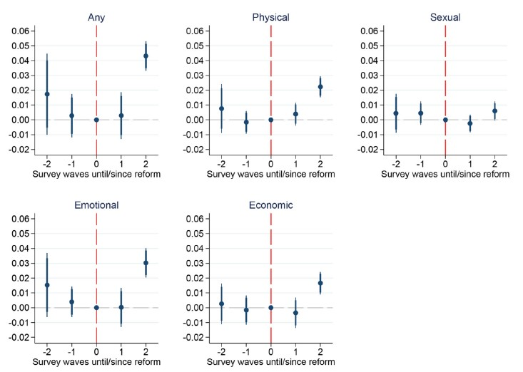
```

???

Metimos casi todos los tests de robustez en el apéndice por si les llama la atención algún resultado y quieren verlo en tabla.

---
#### Tests de Robustez - 1. Validar el supuesto de tendencias paralelas

1.2. Test de falsificación. Se estima el impacto de las reformas en la violencia hacia mujeres encuestadas, perpetrada por $\color{#4B5C96}{\textbf{desconocidos}}$.

```{r, echo=FALSE, out.width="85%", fig.cap="", fig.align="center"}
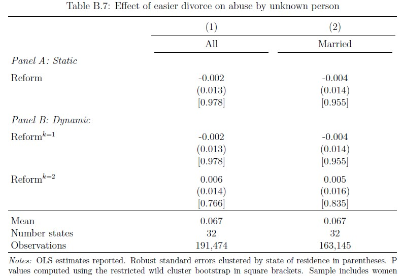
```

---
### Tests de Robustez - 2. Confusores

<div style="text-align: justify">

La autora da validez a la estrategia de identificación al evaluar diferentes factores que podrían agregar variación no aleatoria en el tiempo y afectar sus estimaciones:

  + Aprobación de la ley de "divorcio necesario" en el 2015 a nivel federal.
  
  + Aprobación de leyes estatales contra la violencia doméstica en el periodo de estudio.
  
  + La despenalización del aborto en la CDMX.
  
  + Agregar controles que aproximen por tendencias macroeconómicas, de violencia general, y de equidad de género y nivel de progresividad del estado.
  
  + Diferencias en la variación temporal de los controles entre control y tratamiento.

Ninguno de estos factores produce un cambio relevante en sus resultados.


---
### Tests de Robustez - 3. Tamaño de la muestra

<div style="text-align: justify">

+ Otra preocupación de la autora es el tamaño de su muestra a nivel estatal (32 estados) y temporal (4 encuestas). Por ello, contrasta sus resultados al cambiar sus grupos de control y tratamiento. A pesar de observar cambios menores en sus coeficientes y errores estándar, cada variación que propone la lleva a las mismas conclusiones.

```{r, echo=FALSE, out.width="80%", fig.align="center"}
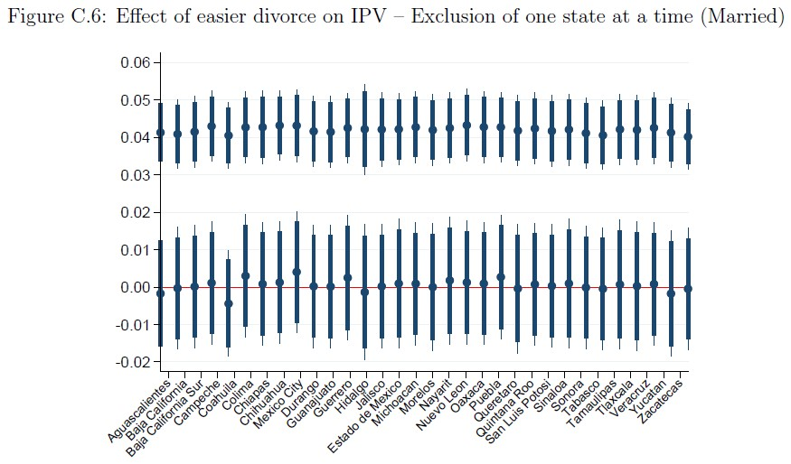
```

???

en cambios de grupo de control y tratamiento, también mencionar la col5 de la b11, o sea mujeres que viven con otras mujeres en los estados de tratamiento como grupo control.
Y las estimaciones exluyendo a un estado a la vez.

---
### Tests de Robustez - 3. Tamaño de la muestra

<div style="text-align: justify">

+ Adicionalmente, considera la posibilidad de que sus resultados presenten sesgos por otras razones como:

  + Migración interestatal
  
  + Errores de medición en la composición de su muestra de mujeres casadas o de su variable dependiente de ser víctima de VP
  
  + Traslape entre la encuesta y los episodios de VP


---
### Tests de robustez - 4. VP vivida vs VP reportada

<div style="text-align: justify">

+ Recordemos que los datos provienen de una encuesta, es decir, son reportados por las propias víctimas.

+ Los resultados podrían estar afectados por cambios en la forma de reportar la información. No obstante, la ENDIREH sigue las guías de la OMS. En la entrevista se evita la palabra violencia y abuso, es llevada a cabo de forma privada y por mujeres capacitadas.

+ Aún así, la autora estima el impacto de leyes de divorcio en la probabilidad de reportar VP a una autoridad. Esta relación tiene el problema de presentar un sesgo de selección: sólo las mujeres que son víctimas de VP van a reportar episodios de VP.

+ Se plantea un modelo de selección de Heckman usando en la primera etapa como regresora de la probabilidad de ser víctima un indicador de si el esposo vivió episodios de violencia en la infancia.

\begin{gather*}
\color{#4B5C96}{\textbf{La probabilidad de reportar cae en los estados donde}} \\
\color{#4B5C96}{\textbf{se introducen reformas al divorcio.}}
\end{gather*}

+ Esto implica que, si reportar VP en la encuesta ha cambiado como reportar VP a las autoridades, los resultados estarían sesgados a la baja y podrían interpretarse como una cota inferior.


---
### Mecanismos

```{r, echo=FALSE, out.width="85%", fig.cap="", fig.align="center"}
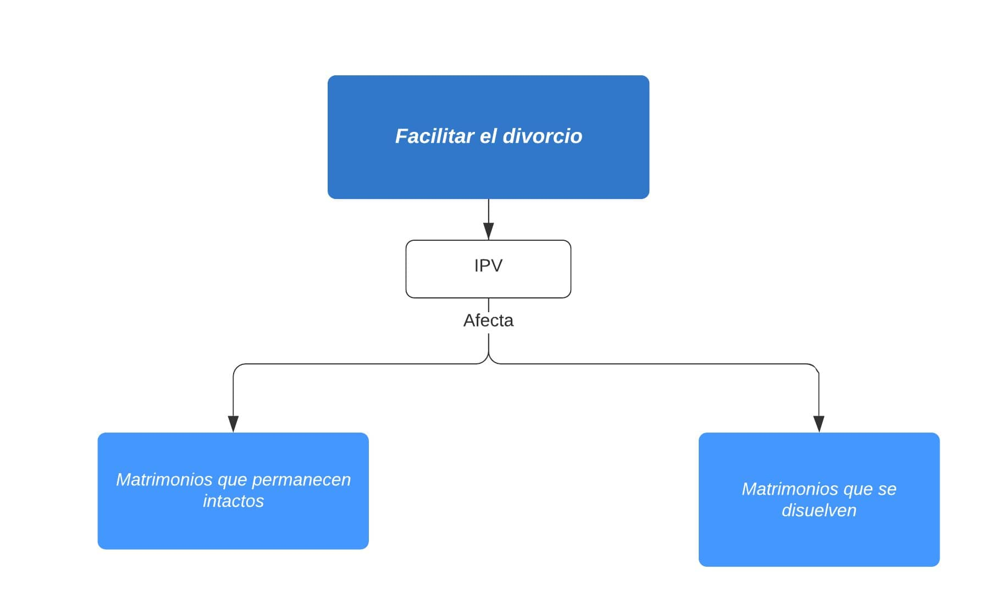
```


---
### Mecanismos: efectos de reforma en VP y estado civil

```{r, echo=FALSE, out.width="100%", fig.align="center"}
knitr::include_graphics("img/Tabla72.jpg")
```

---
### Mecanismos: matrimonios intactos

```{r, echo=FALSE, out.width="65%", fig.cap="", fig.align="center"}
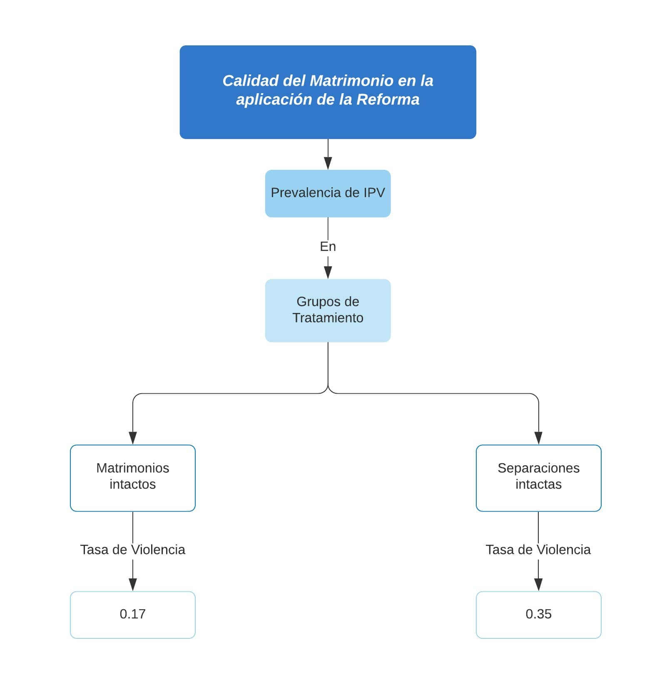
```

---
### Mecanismos: matrimonios intactos

```{r, echo=FALSE, out.width="85%", fig.cap="", fig.align="center"}
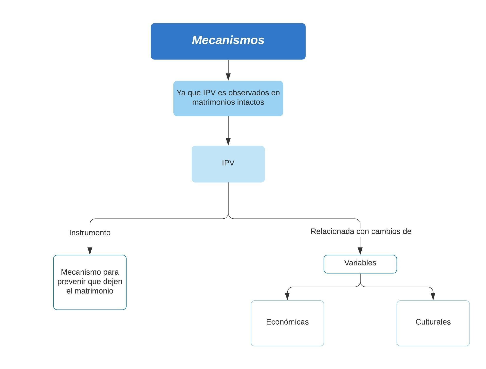
```

---
### Mecanismos: VP como instrumento de control

<div style="text-align: justify">
Es posible que matrimonios que no se divorciaron al suceder la reforma eran de buena calidad, a menos que este status haya cambiado en el tiempo. Sin embargo, el que las mujeres intenten dejar un matrimonio puede ser un proceso de años.

En el corto plazo, pueden haber herramientas no violentas para persuadir a las esposas a quedarse en él:

* Redistribución de recursos hacia ellas
* Amenazas*
* Comportamiento afectivo

Mas estas pueden dejar de ser efectivas, comenzando el IPV. **Su ocurrencia es más probable ante un mayor nivel educativo de la mujer.**

* Amenazas es una forma de VP.

---
### Mecanismos: VP como instrumento de control

```{r, echo=FALSE, out.width="135%", fig.align="center"}
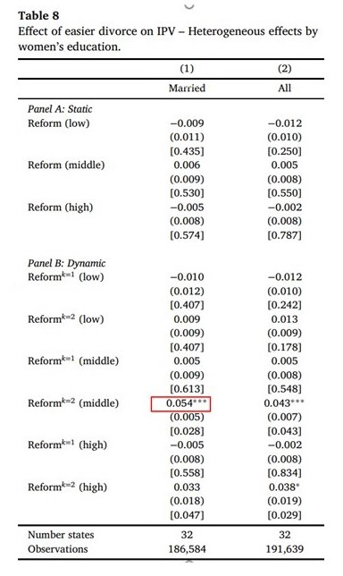
```

---
### Mecanismos: Efectos Heterogéneos 

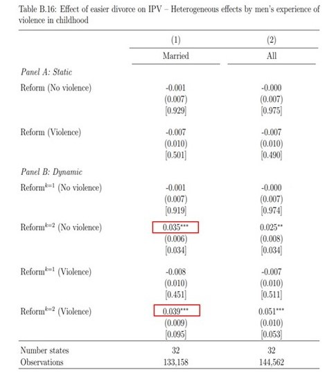

<div style="text-align: justify">


1. Efectos heterogéneos por presencia de niños menores de 18 años en el hogar

2. Efectos heterogéneos por "tipo de hombre"


---

## Mecanismos: VP y variables externas
<div style="text-align: justify">
  
La reforma pudo haber afectado de forma directa o indireca a variables relacionadas con VP. A su vez, estos mecanismos se pudieron haber activado de forma retardada.


+ La autora estima si la reforma tuvo un impacto en alguna de estas variables, obtiene coeficientes no significativos en el corto y largo plazo. Concluye es poco probable que los cambios en estas variables estén explicando el patrón observado en la VP.

---
### Limitaciones y conclusiones

<div style="text-align: justify">

Se aprovecha la variación temporal en la introducción de la reforma de divorcio unilateral en estados de México para estimar el efecto de facilitar el divorcio en VP.

El principal efecto encontrado en este trabajo es que, en el largo plazo, la aprobación del divorcio unilateral aumenta la violencia marital en 3.7 puntos porcentuales (21% con respecto a la media). Por otra parte, en el corto plazo no hay evidencia de un cambio significativo en VP. Estos efectos son robustos a múltiples pruebas.

El hallazgo es de especial importancia dado que es contrario a lo que se había encontrado en países en desarrollo previamente. Hay otras implicaciones de política pública.

No obstante, el resultado de largo plazo proviene de dos estados del país. Esta es la principal **limitación** del trabajo. ¿Se llegaría a las mismas conclusiones incluyendo la futura ENDIREH 2021?

---
## Limitaciones

Algunas limitaciones adicionales podrían ser: 

* Poder de negociación? 
* Relación de la educación como variable de proxy de las opciones externas podría tener variables omitidas
* male backlash effect -> husband perceives improvement of wife's outside option throigh the reduction of the cost of divorce as a threat to his culturally prescribed dominant role
* Cambio en la compensación económica de la reforma como posible mecanismo de violencia -> si no había inocente no había compensación económica
* reforma -> corto plazo -> se divorcian malos, pero los peores ? no será que ya estaban prontos a caducarse -> esto implica que los que se quedaron son buenos? pero sí controla por tiempo que llevan casados. Tal vez el ciclo de un matrimonio no determinado por duración, intuitivamente no hay correlación. Más bien sería un marital selection donde hay un ciclo que funciona de alguna forma que no conocemos, o de factores que hacen que las mujeres se queden -> no "buenos que se volvieron malos" 
* does the divorce channel explain the rise in IPV? did the worst stay married? -> esto se ve en la joint probability de coral
* women's experience of violence in her childhood?
* bargaining power-> contribution to decision making

La ENDIREH 2021 capturará sucesos de pandemia. Hay evidencia de que en pandemia la violencia doméstica aumentó... ¿será posible usar esta información para el presente estudio?

---
 <style>

 .container {
  height: 600px;
  position: relative;
}

.vertical-center {
  margin: 0;
  position: absolute;
  top: 50%;
  left: 50%;
  -ms-transform: translate(-50%, -50%);
  transform: translate(-50%, -50%);
  color: #1c5253;
  font-size:50px;
  font-weight: 800;
}

</style>

<div class="container">
  <div class="vertical-center">
    <p>Anexo: </p>
    Tablas y Gráficas Adicionales
  </div>
</div>


---
### Efecto de facilitar el divorcio en VIP - Factores de confusión potenciales, muestra de mujeres casadas

```{r, echo=FALSE, out.width="90%", fig.cap="", fig.align="center"}
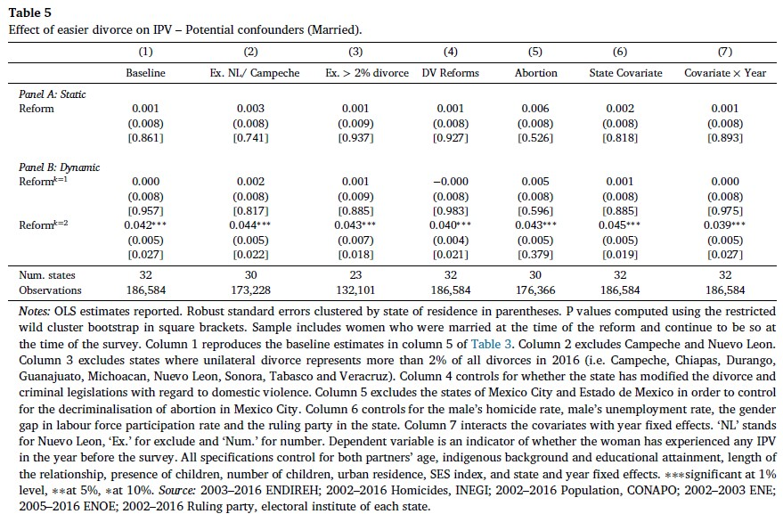
```


---
### Efecto de facilitar divorcio en VIP - grupos de control y tratamiento alternativos

```{r, echo=FALSE, out.width="95%", fig.cap="", fig.align="center"}
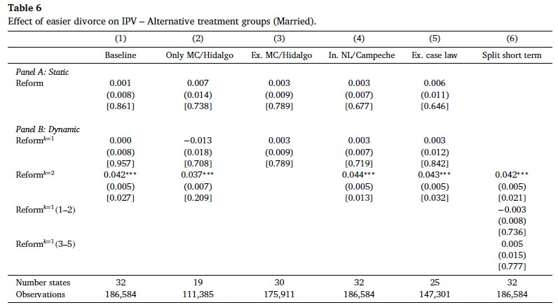
```

---
### Efecto de faciliar el divorcio en las tasas de migración interestatales


```{r, echo=FALSE, out.width="75%", fig.cap="", fig.align="center"}
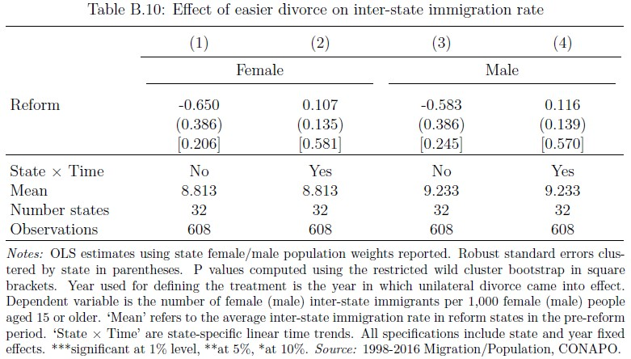
```

---
### Pruebas de robustez adicionales


```{r, echo=FALSE, out.width="75%", fig.align="center"}
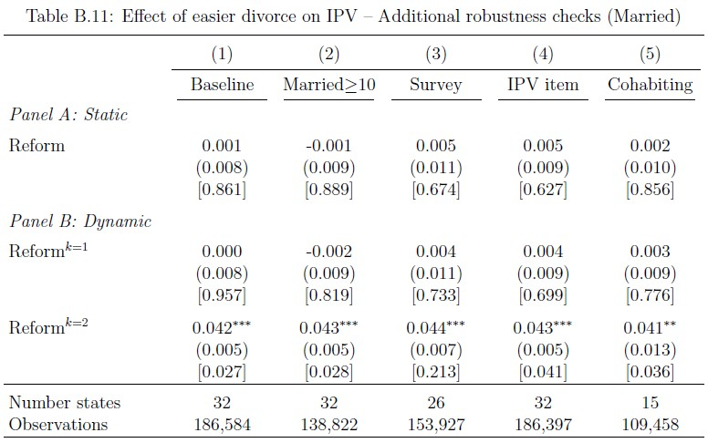
```

---
### Efecto de facilitar el divorcio en VP - muestra restringida por valores faltantes
```{r, echo=FALSE, out.width="75%", fig.align="center"}
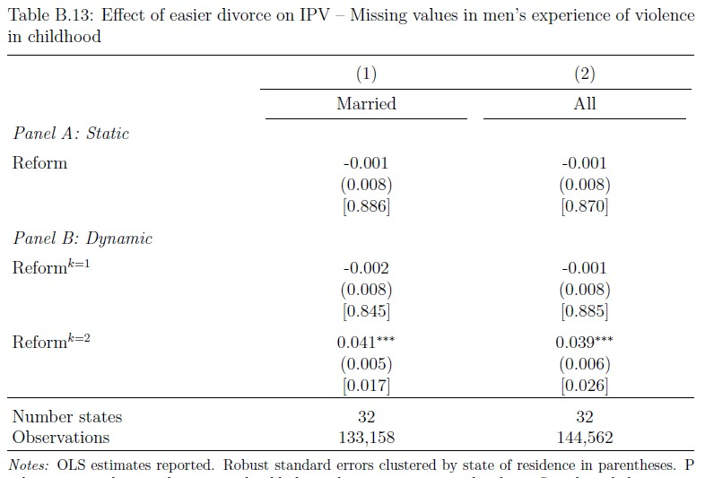
```

---
### VP vivida vs VP reportada

```{r, echo=FALSE, out.width="75%", fig.align="center"}
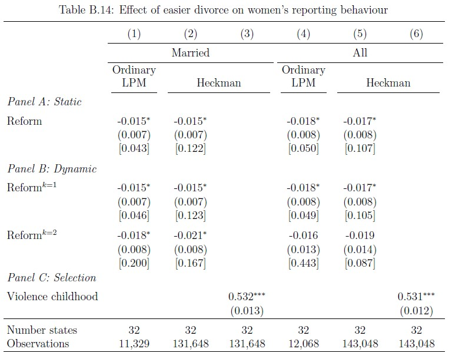
```

---
## Mecanismos: VP y variables externas

```{r, echo=FALSE, out.width="75%", fig.align="center"}
knitr::include_graphics("img/TablaB17.jpg")
```


